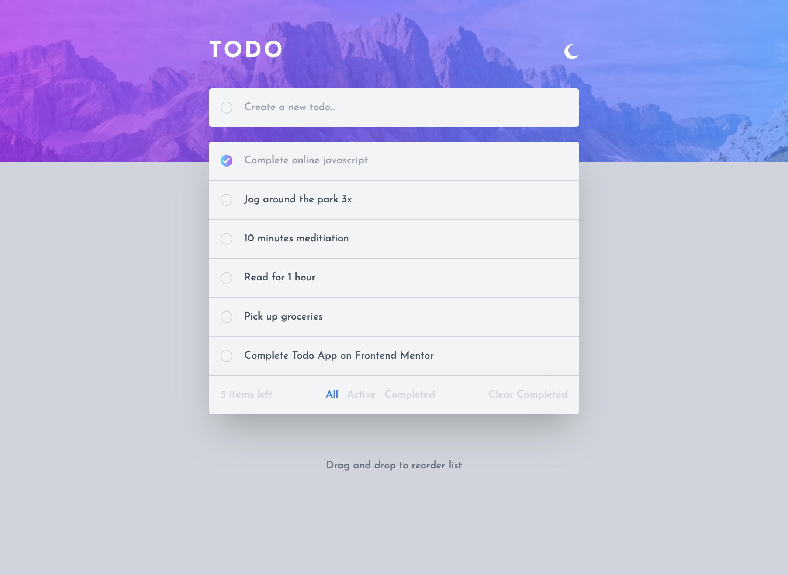
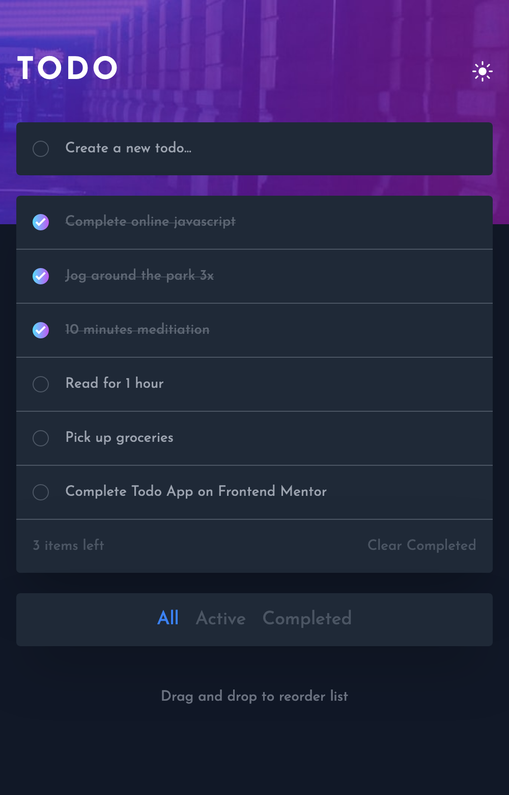

# Todo App

## Overview

A simple todo application built with React and Tailwind CSS that allows users to manage their tasks efficiently.

## Features

- **Responsive Design**: The app is optimized for various screen sizes, providing an optimal layout for both desktop and mobile devices.
- **Interactive Elements**: Interactive elements on the page have hover states for better user experience.
- **Add New Todo**s: Easily add new tasks to your list with the user-friendly input field.
- **Mark Todos as Complete**: Keep track of completed tasks by marking them as complete.
- **Delete Todos**: Remove tasks from the list when they're no longer needed.
- **Filter Options**: Choose to view all todos, active todos, or completed todos based on your preference.
- **Clear Completed**: Quickly clear all completed tasks from the list.
- **Light and Dark Mode**: Toggle between light and dark mode to suit your visual preferences.
- **Drag and Drop**: Reorder items on the list by dragging and dropping them in the desired order.
- **Data Persistence**: This Todo App utilizes the browser's "**localStorage**" to persist todo items, ensuring that your tasks are saved even if you close the application or refresh the page.

### Screenshot

### Link

[Todo App](https://nimscodes.github.io/todo-main/)

##  Usage

- Add new todos by typing your task and hitting Enter or clicking the "Add" button.
- Mark todos as complete by clicking the checkbox next to each task.
- Delete todos by clicking the delete icon when hovering over a task.
- Use the filter buttons to view all, active, or completed todos.
- Clear all completed todos using the "Clear Completed" button.
- Toggle between light and dark mode using the mode switcher.
